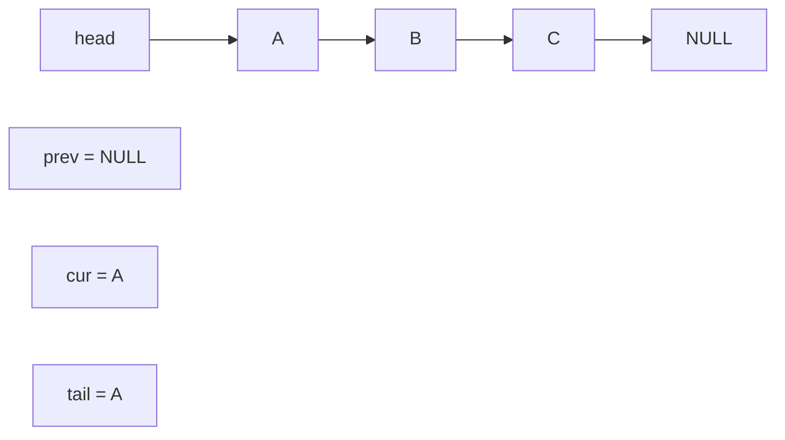
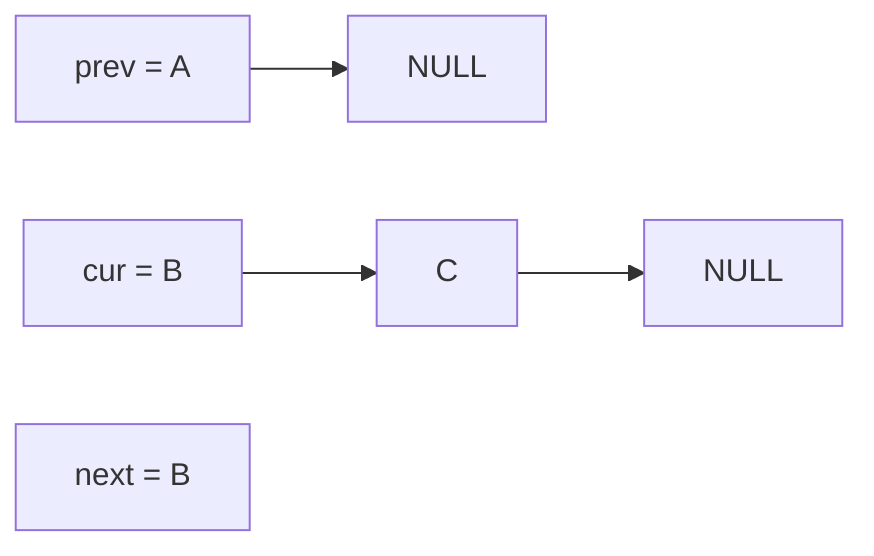
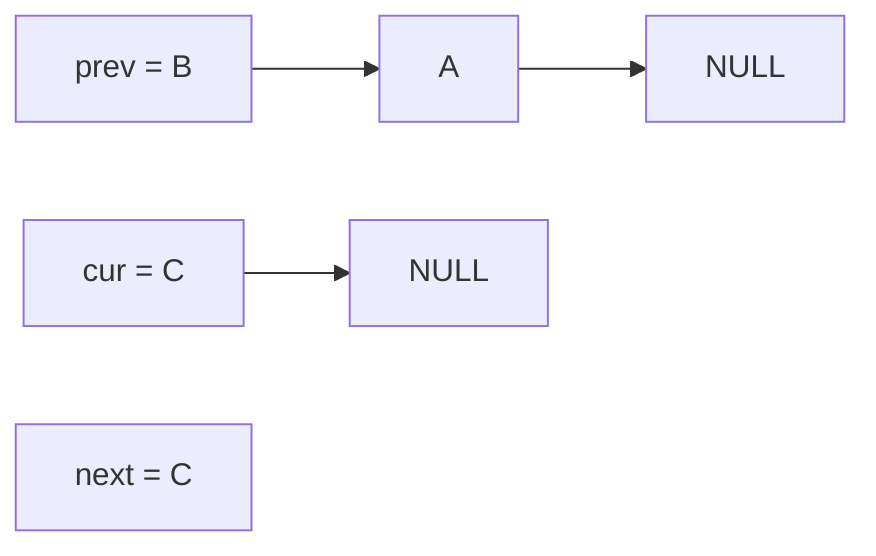
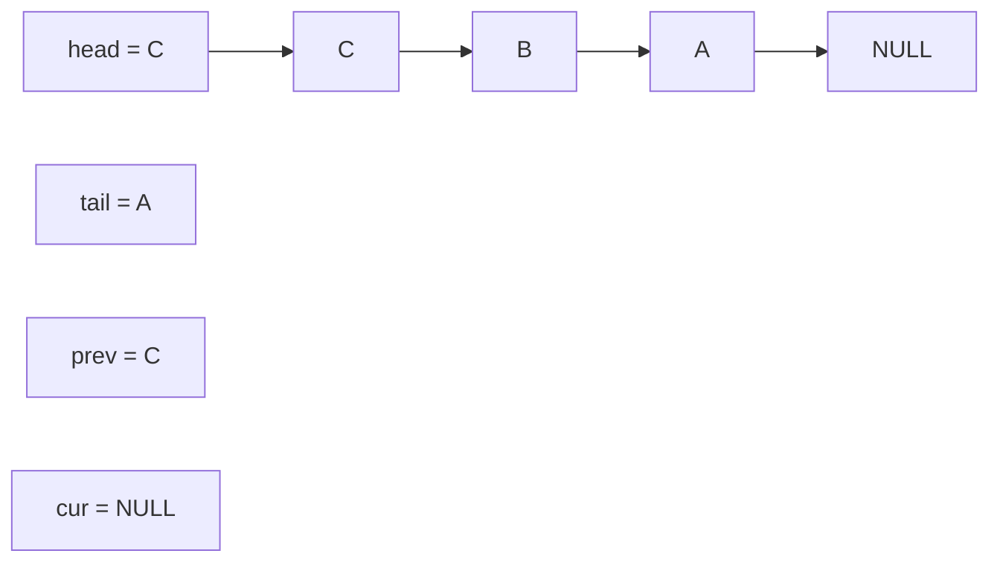

# L0 C Programming Lab

- 問題文: [L0-cprogramminglab.pdf](../labs/L0-cprogramminglab.pdf)
- 問題ファイル: `handout/`

## 何をする lab か

単方向 linked list ベースの queue を実装する。FIFO と LIFO の両方を正しく扱えて、`NULL` や不正入力でも壊れない実装にする。

## 触るファイル

- `handout/queue.c`
- `handout/queue.h`

## 何をすればよいか

1. `handout/` で `make` を実行してビルドする
2. queue の各操作を `queue.c` / `queue.h` に実装する
3. `make check` で driver を回して確認する
4. 必要なら `./qtest` で個別に挙動を見る

## 見るべきポイント

- メモリ確保と解放が漏れないこと
- 空 queue や `NULL` でも落ちないこと
- 末尾ポインタや要素数など、性能改善用の補助情報を正しく保つこと

## `queue_reverse` の考え方

(これわからなかった...)

`queue_reverse` は、新しい node を作らずに `next` ポインタの向きをひっくり返して queue を反転する。

使うポインタは 3 本だけ。

- `cur`: 今見ている node
- `prev`: すでに反転し終わった部分の先頭
- `next`: 元のリストの残りを見失わないための退避

最初の状態はこう。



反転ループの中では毎回この順番で処理する。

1. `next = cur->next`
2. `cur->next = prev`
3. `prev = cur`
4. `cur = next`

1 回目の反転後はこうなる。



2 回目の反転後はこうなる。



3 回目まで終わると、`prev` が反転後リストの先頭になる。



コード上の対応はこれ。

```c
list_ele_t *prev = NULL;
list_ele_t *cur = q->head;
q->tail = cur;

while (cur != NULL) {
    list_ele_t *next = cur->next;
    cur->next = prev;
    prev = cur;
    cur = next;
}

q->head = prev;
```

`next` を先に保存しないと、`cur->next = prev` した時点で元の残りリストを辿れなくなる。そこが一番大事。
